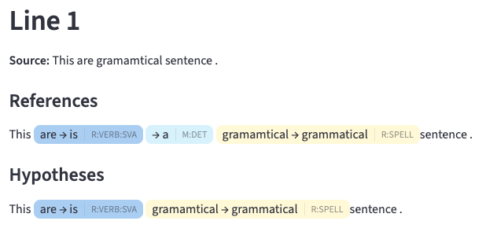

# GEC Analyzer

GEC Analyzer is a visualizer for Grammtical Error Correction efficiently.

- You can see the error correction easily.
- You can narrow down your search by error type (ERRANT definition).

# Demo
This is available on Streamlit Cloud:  
[https://gec-analyzer.streamlit.app/](https://gec-analyzer.streamlit.app/)

