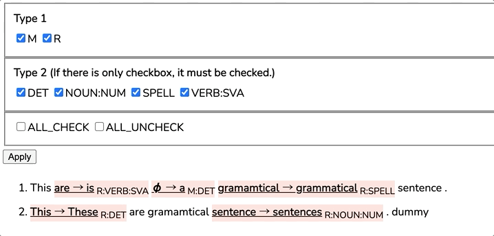

# GEC_analyzer

GEC-analyzer (tentative) is a tool for viewing error correction information efficiency.

python >=3.7



### Install

```sh
pip install -r requirements.txt
python -m spacy download en
```

### Usage

```sh
python run.py --orig <orig file> --cor <cor file>
```

or

```sh
python run.py --m2 <m2 file> --ref_id <integer>
```

`--ref_id` is optional, default is `0`.

### Demo

1. Enter original sentences and corrected sentences.

   ```sh
   python run.py --orig demo/orig.txt --cor demo/cor.txt
   ```

2. Enter a M2 file which is annotated ERRANT's error type.

   ```sh
   python run.py --m2 demo/errant_type.m2
   ```


3. Enter a M2 file which is annotated other error type, such as CoNLL-2014 definition.

   ```sh
   python run.py --m2 demo/other_type.m2
   ```

   